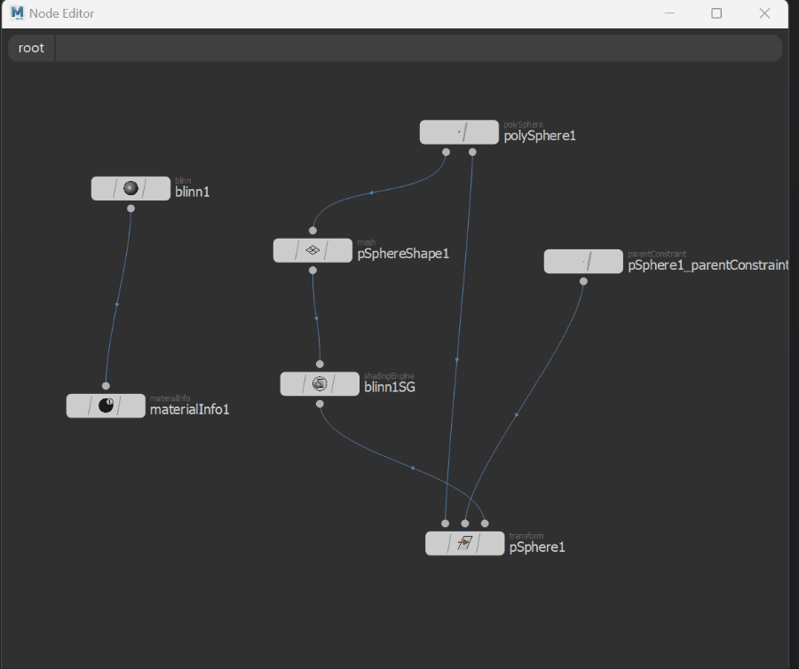
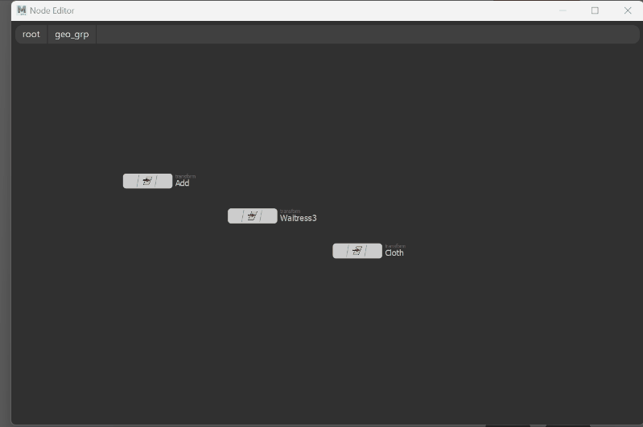

An attempt to make  global scene node editor 
for maya in QT. 

Unfinished. 
I decided to freeze this  project, because I can see it probable
will result in a dead end. 
To navigate through scene you need to 
select one of the nodes and double-click on it,
or I (inside) / O(outside) hotkeys will work.
Sockets/edges connections editing is implemented inside
UI but giving no results on a scene itself, it's just a UI part.

To launch this in maya, please add this repo
as new module in maya and launch this code:

>import sys
> 
>sys.path.insert(0, "path_to_repo/maya_node_editor")
> 
>from editor_window import NodeEditorWindow
> 
>wnd = NodeEditorWindow()

Small article about this editor:
http://golubevcg.com/post/global_node_editor_in_maya

How it looks launched on simple example:

>

>


```
Developed by
Andrew Golubev
golubevcg@gmail.com
```